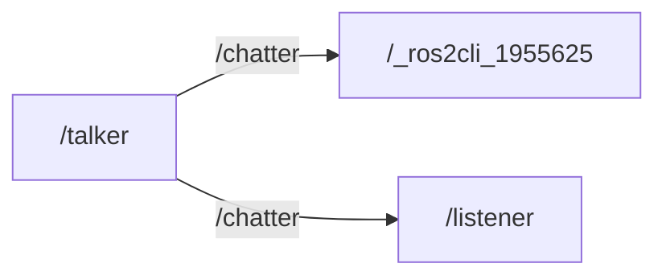

# rmermaid_graph

My rqt_graph outputs **mermaid** and GUI.


```bash
# output example
==== Export mermaid ====
'''mermaid
graph LR
/talker--> |/chatter| /_ros2cli_1955625
/talker--> |/chatter| /listener
'''
========================

```

