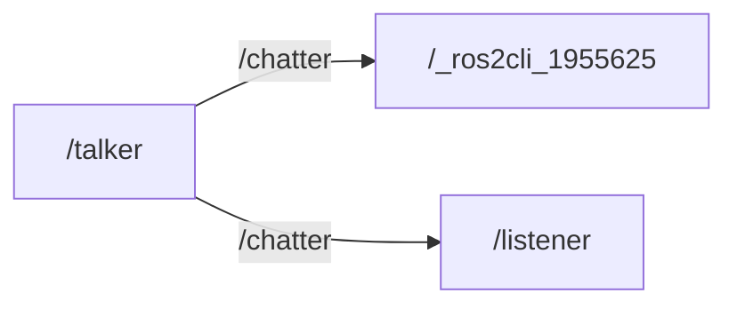
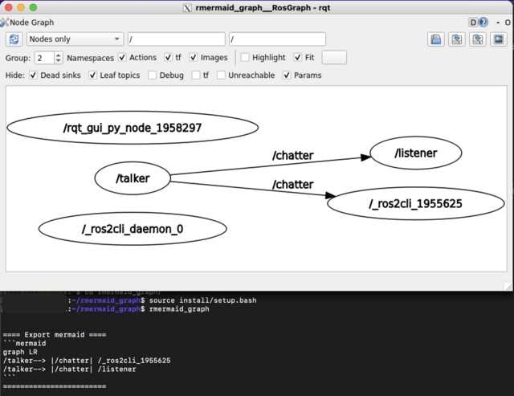

# rmermaid_graph

My rqt_graph outputs **mermaid** and GUI.

<br>

**I want test cases for verification!** (more complicated, less dependency )

<br>

## Usage

### Download & Build

```bash
mkdir -p ~/ws_galactic/src
cd ~/ws_galactic/src
git clone https://github.com/Ar-Ray-code/rmermaid_graph.git
cd ../
# build
source /opt/ros/galactic/setup.bash
colcon build --symlink-install
```

### Run

```bash
source ~/ws_galactic/install/setup.bash
rmermaid_graph

# # output example
# > ==== Export mermaid ====
# > '''mermaid
# > graph LR
# > /talker--> |/chatter| /_ros2cli_1955625
# > /talker--> |/chatter| /listener
# > '''
# > ========================

```

<br>

### Generated mermaid



<br>

